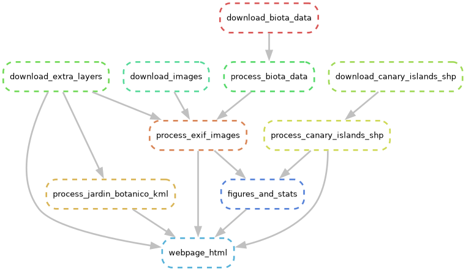

# ***Página web de especies que encuentro por Gran Canaria***.

La idea es hacer una web con [***GitHub Pages***](https://pages.github.com/), para anotar observaciones de especies en visores geográficos (GIS), gráficos con estadísticas, e inventarios de especies con tablas interactivas.

* Para ello usaré [***SANAKEMAKE***](https://snakemake.readthedocs.io/en/stable/) y [***GITHUB ACTIONS***](https://github.com/features/actions).
* Las imágenes se descargarán desde mi cuenta de ***DROPBOX***. Si no se actualiza manualmente, GitHub Actions actualiza la página automáticamente los sábados a las 00:00 horas aproximadamente con las nuevas imágenes añadidas.
* Los datos pertenecen hasta el momento a invertebrados, flora y vegetación (no descarto otros organismos en un futuro). 
* Se usan datos de bases de datos públicos:
    * Datos abiertos que usa la entidad de [GRAFCAN](https://www.grafcan.es/) (Gobierno de Canarias) en su Infraestructura de Datos Espaciales de Canarias ([IDECanarias](https://www.idecanarias.es/)): [SITECAN](https://opendata.sitcan.es/)
    * Banco de datos de Biodiversidad de canarias ([BIOCAN, Gobierno de Canarias](https://www.biodiversidadcanarias.es/))

### **Estado del workflow de snakemake**

