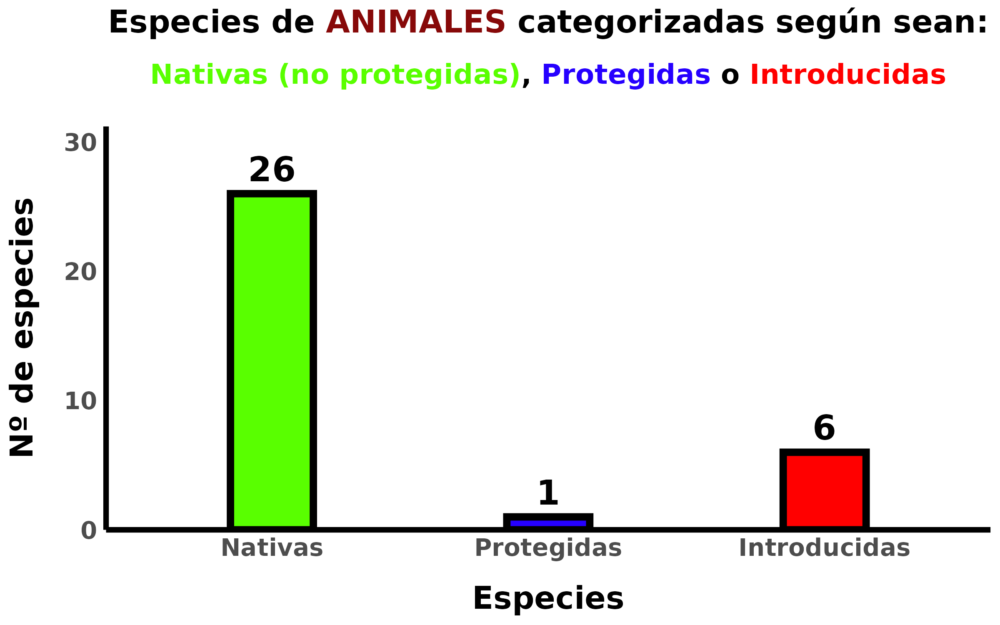
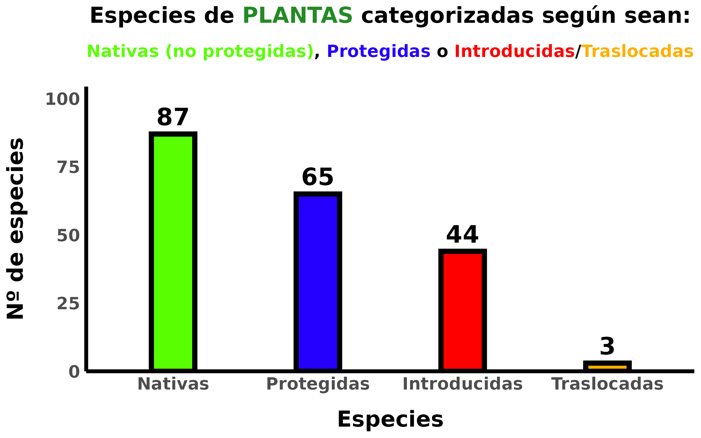

```{r setup, include=FALSE}
knitr::opts_chunk$set(echo = TRUE)
```

```{css, echo = FALSE}
.author, .title {
    display: none;
}
#.main-container {
        #width: 100%;
        #height: 100vh;
#}
body{
    background-color: #fff3d8;
    #font-size: 1.2vw;
}
```
# <strong>Descarga las fotografías de las especies en los mapas interativos</strong> 

```{r, echo = FALSE, message = FALSE, warning=FALSE}
source("code/07statistics.R")
```

[link ai]: https://www.dropbox.com/scl/fo/j8wy15nzlrpn98dkpsu6e/h?rlkey=27la6qjalew06kc9wy3cgundv&dl=1

[link fv]: https://www.dropbox.com/scl/fo/z9ad8tcbh02d2zy7g7xf0/h?rlkey=yvu3gii63sfvpicsgplvbty88&dl=1

<center>

  |         **MAPA**             | **Nº CLASIFICADAS** | **Nº NO CLASIFICADAS** | **DESCARGA**      | 
  | :--------------------------: | :-----------------: | :--------------------: | :---------------: |
  | *Mapa de invertebrados*      | `r tabla_n_ai$n[1]`  | `r tabla_n_ai$n[2]`   |   [link imágenes de invertebrados](https://www.dropbox.com/scl/fo/z9ad8tcbh02d2zy7g7xf0/h?rlkey=yvu3gii63sfvpicsgplvbty88&dl=1) | 
  | *Mapa de flora y vegetación* | `r tabla_n_fv$n[1]`  | `r tabla_n_fv$n[2]`   |   [link imágenes de flora y vegetación](https://www.dropbox.com/scl/fo/z9ad8tcbh02d2zy7g7xf0/h?rlkey=yvu3gii63sfvpicsgplvbty88&dl=1) |

</center>

* Se puede ver información sobre las imágenes de las fotografías en la carpeta de [documentación](`r rmarkdown::metadata$documentation`).

# **Estadísticas de los organismos**

## Número de especies de Metazoos y Plantas Clasificadas:    

<center>


</center>

## Tabla de la endemicidad de las especies de plantas y animales identificadas:

```{r, echo = FALSE, message = FALSE, warning=FALSE}
gt_endemism
```

## Especies categorizadas según su *origen* y *protección*:

### Gráfico para las especies de invertebrados:

<center>



</center>

### Gráfico para las especies de plantas:

<center>



</center>

# **Volver a los mapas interactivos**

<a href="./invertebrates">&#9664; Volver al mapa de invertebrados</a>  
<a href="./flora">&#9664; Volver al mapa de flora</a>  

Última actualización el `r format(lubridate::today(), "%d/%m/%Y")`  
Sitio [**desarrollado**](`r rmarkdown::metadata$github_repo`) por [<i class="fab fa-github"></i> **Juan Carlos García Estupiñán**](`r rmarkdown::metadata$github`)  
[**&#x2709; GMAIL**](mailto:`r rmarkdown::metadata$email_adress`)
