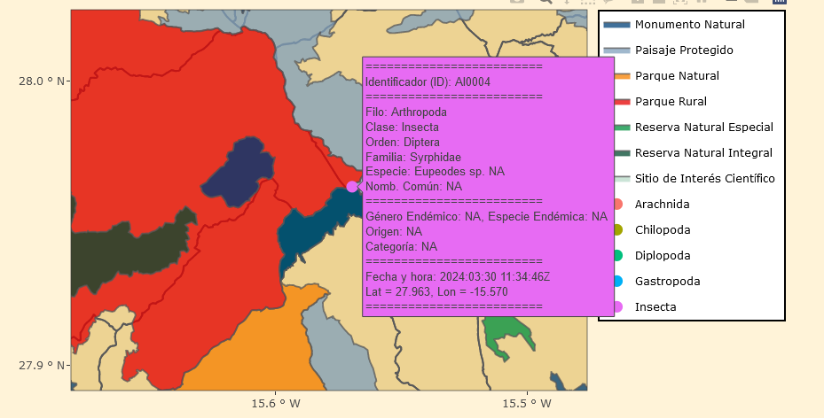
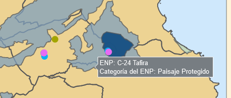
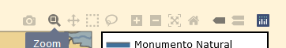
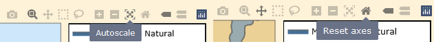
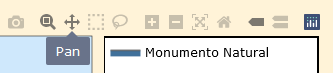

# **DOCUMENTACIÓN DEL WORKFLOW, DATOS Y RESULTADOS** 

**Tabla de contenidos**

- [Plataforma ideal](#plataforma-ideal)
- [Uso básico de los mapas interactivos](#uso-básico-de-los-mapas-interactivos)
  - [Información sobre las especies en las etiquetas](#información-sobre-las-especies-en-las-etiquetas)
  - [Elementos del mapa](#elementos-del-mapa)
- [Fotografías de las especies](#fotografías-de-las-especies)
  - [Información de las especies](#información-sobre-las-especies)
  - [Etiquetado de las imágenes JPG](#etiquetado-de-las-imágenes-jpg)
  - [Aclaraciones](#aclaraciones)

## **Plataforma ideal**

La página está pensada para usar en PC. En móvil se puede usar, pero hay que ajustar manualmente el zoom de la pantalla a la hora de usar los mapas y es muy incómodo.

## **USO BÁSICO DE LOS MAPAS INTERACTIVOS**

### **Información sobre las especies en las etiquetas**

* Para ver la información de las etiquetas de cada una de las especies basta con poner el ratón encima de los puntos coloreados. Nótese que los colores estarán basado en la ***Clase*** a la que pertenezca la especie.



* Al colocar el ratón en los bordes de los Espacios Naturales Protegidos se puede obtener información sobre estos. 



### **Elementos del mapa**



No hay que tener en cuenta todos, solo algunos que son de gran utilidad:

* La lupa (***zoom*** :mag_right:) está por defecto, sirve para zoom recortando un cuadrado-rectángulo, además se puede hacer ***zum in*** con :heavy_plus_sign: o ***zum out*** con :heavy_minus_sign:. 
  * Para este cometido está muy bien también ***Autoscale*** o ***Reset axes*** para volver al estado original del mapa.



  * Tambíen se puede hacer zoom in y out con la rueda del ratón, pero es verdad que ocasiones se atasca y hay que jugar un poco con el, en ese momento es conveniente combinar la rueda del ratón con otras opciones como :mag_right:, :heavy_plus_sign:, :heavy_minus_sign:. 

* Para moverse de un lado a otro es necesario cambiar a la opción analógica (***Pan***) que está al lado de lupa. 



* El resto de opciones no son tan importantes.

## **FOTOGRAFÍAS DE LAS ESPECIES**

### **Información sobre las especies**

La información de las especies se ha obtenido principalmente del buscador [***"Biota"***](https://www.biodiversidadcanarias.es/biota/)

### **Etiquetado de las imágenes JPG**

Las fotografías en formato JPG están nombradas con la información de las especies, mediante el uso guiones altos ("```-```") para separar la información, que se procesarán en los programas. 

* Las imágenes de invertebrados tienen la siguiente información: 

```
ID-Especie-Autor-Nombre común-Familia-Orden-Clase-Filo-Reino Metazoa-Género Endémico (Canarias)-Especie Endémica (Canarias)-Subespecie Endémica (Canarias)-Origen-Categoría (especie protegida o invasora)
``` 

* La información de la flora y vegetación: 

```
ID-Especie-Autor-Nombre común-Familia-Orden-Clase-Subdivisión-División-Reino Plantae-Género Endémico (Canarias)-Especie Endémica (Canarias)-Subespecie Endémica (Canarias)-Origen-Categoría (especie protegida o invasora)
``` 

* Ejemplo de una de especie:

```
FV0022-Pinus canariensis-C. Sm. ex DC.in Buch-Pino canario-pinaceae-pinales-pinopsida-coniferophytina-spermatophyta-plantae-eg_no-ee_si--ns-ep.jpg
```

### **Aclaraciones:** 

- En caso de no identificarse la especie se anota como: ```"Su ID"-NO CLASIFICADO.jpg```.

- Las variables **género, especie y subespecie endémicas** se tratan de variables binarias:

<center>

  |         **Variable**           | **Endémico**    | **NO Endémico** | 
  | ------------------------------ | --------------- | --------------- |
  | Género Endémico (Canarias)     |      eg_si      |   eg_no         | 
  | Especie Endémica (Canarias)    |      ee_si      |   ee_no         |
  | Subespecie Endémica (Canarias) |      es_si      |   es_no         |

</center>

- La variable **origen** tiene los sigientes valores:

<center>


  | **Valor**  |  **Significado**               | 
  | ---------- | ------------------------------ |
  | ns         | Nativo Seguro                  | 
  | np         | Nativo Probable                |
  | isi        | Introdicido seguro invasor     |
  | isn        | Introducido seguro no invasor  |
  | ip         | Introducido probable           |

</center>

- La variable **Categoría** explica como está catalogada la especie.

<center>

  | **Valor**  |  **Significado**               | 
  | ---------- | ------------------------------ |
  | ep         | **Especie protegida**          | 
  | ei         | **Especie invasora**           |

</center>

- En caso de necesitar tildes, el software utilizado no es capaz de leerlos, en ese caso de haber alguna palabra con tilde se deberá escribir la sílaba entre dos _ y una t (ejemplo: `_ta_` = tilde en la a, `á`). Similar con la ñ (`_enie_` = `ñ`). Otro tipo de carácter especial como `¨` está en vías de desarrollo, por el momento no lo pongo en los nombres de las imágenes.

<center>

  | `á`       | `é`       | `í`       | `ó`       | `ú`       | `ñ`       | 
  | -------   | -------   | -------   | -------   | -------   | -------   |
  | `_ta_`    | `_te_`    | `_ti_`    | `_to_`    | `_tu_`    | `_enie_`  | 

</center>

- En caso de no identificar un parámetro en concreto no se añade nada entre los guiones (ej. FV0022 el Pino canario no es una subespecie, con lo que no se añade ningún valor entre los guines: ```FV0022-...-ee_si--ns-...```).