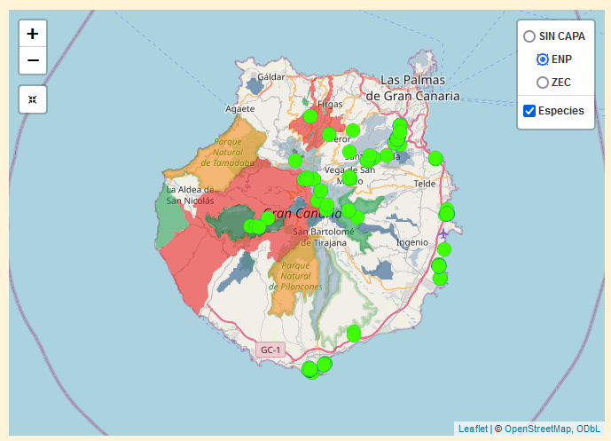

# **DOCUMENTACIÓN DEL WORKFLOW, DATOS Y RESULTADOS** 

**Tabla de contenidos**

- [Plataforma ideal](#plataforma-ideal)
- [Uso básico de los mapas interactivos](#uso-básico-de-los-mapas-interactivos)
  - [Moverse y *zoom in* y *zoom out*](#1-moverse-y-zoom-in-y-zoom-out)
  - [Puntos del mapa](#2-puntos-del-mapa)
  - [Filtrar especies](#3-filtrar-especies)
  - [Cargar capas](#4-cargar-capas)
  - [Volver al zoom original](#5-volver-al-zoom-original)
- [Fotografías de las especies](#fotografías-de-las-especies)
  - [Información de las especies](#información-sobre-las-especies)
  - [Etiquetado de las imágenes JPG](#etiquetado-de-las-imágenes-jpg)
  - [Aclaraciones](#aclaraciones)

## **Plataforma ideal**

La página está pensada para usar en PC. En móvil se puede usar, pero hay que ajustar manualmente el zoom de la pantalla a la hora de usar los mapas y es muy incómodo.

## **USO BÁSICO DE LOS MAPAS INTERACTIVOS**


### 1. **Moverse y *zoom in* y *zoom out.***

* Para moverse hay que presionar clic derecho en un sitio del mapa y arrastrar en la dirección que queramos.
* Para hacer zoom podemos usar la rueda del ratón o los símbolos "+" o "-" en la parte izquierda superior del mapa.

### 2. **Puntos del mapa**. 

* Cada punto del mapa es un ejemplar de una especie identificada.
* Al presionar sobre los puntos se nos presenta una etiqueta con su identificación.


### 3. **Filtrar especies**. 

* Para ello solo hace falta filtrar la especie de interés en la barra arriba del mapa que dice ***"BUSCA LAS ESPECIES!!!"***:


* Se puede filtrar **más de una** especie a la vez:


### 4. **Cargar capas**. 

* Se pueden cargar capas del IDECanarias, por el momento se encuentran los ***Espacios Naturales Protegidos*** (**ENP**) de la isla de Gran Canaria, así como las ***Zonas de Especial Conservación*** (**ZEC**).
* Para ello hay que poner el ratón el icono de arriba a la derecha que representa las capas:


* Por defecto está la opción "***Sin capa***". Si seleccionamos "***ENP***" por ejemplo, cargamos los Especios Naturales Protegidos.



* Del mismo modo que con los puntos de las especies, si hacemos clic con el ratón sobre un ENP, obtendremos información de el:


### 5. **Volver al zoom original:**

* En caso de hacer mucho *zoom in* o *zoom out* podemos presionar con clic derecho un botón de *"reset"* que se encuentra debajo de los botones del zoom.

* En caso de hacer mucho *zoom in* o *zoom out*, podemos clicar en el botón


### 5. **Uso combinado con la tabla de Especies** 

* Es interesante combinar el uso del mapa con la tabla `HTML` debajo, sobre todo para comparar los resultados con bases de datos como biota (pretendo de que hayan más en el futuro como `GBIF`)

* Ejemplo: Buscamos la especie invasora *Centranthus ruber* en el mapa:


* Filtramos a su vez esta especie en el buscador de la tabla dinámica:


* Una opción interesante es *abrir en otra ventana* la web de Biota para ver imágenes de las especies y comparar mis observaciones con esta WEB:


## **FOTOGRAFÍAS DE LAS ESPECIES**

Puedes descargas las imágenes en el siguiente en este [LINK](https://juankkar.github.io/Especies_Encontradas_GC/data) 

### **Información sobre las especies**

La información de las especies se ha obtenido principalmente del buscador [***"Biota"***](https://www.biodiversidadcanarias.es/biota/)

### **Etiquetado de las imágenes JPG**

Las fotografías en formato JPG están nombradas con la información de las especies, mediante el uso guiones altos ("```-```") para separar la información, que se procesarán en los programas. 

* Las imágenes de invertebrados y plantas tienen la siguiente información: 

```
ID-Especie-Autor-Género Endémico (Canarias)-Especie Endémica (Canarias)-Subespecie Endémica (Canarias)-Origen-Categoría (especie protegida o invasora)-Hábitat-ID Biota
``` 

* Ejemplo de una de especie:

```
 FV0022-Pinus canariensis-C. Sm. ex DC.in Buch-eg_no-ee_si--ns-ep-P_LHR-F00068.jpg
```

### **Aclaraciones:** 

- En caso de no identificarse la especie se anota como: ```"Su ID"-NO CLASIFICADO.jpg```.

- Las variables **género, especie y subespecie endémicas** se tratan de variables binarias:

<center>

  |         **Variable**           | **Endémico**    | **NO Endémico** | 
  | ------------------------------ | --------------- | --------------- |
  | Género Endémico (Canarias)     |      eg_si      |   eg_no         | 
  | Especie Endémica (Canarias)    |      ee_si      |   ee_no         |
  | Subespecie Endémica (Canarias) |      es_si      |   es_no         |

</center>

- La variable **origen** tiene los sigientes valores:

<center>


  | **Valor**  |  **Significado**               | 
  | ---------- | ------------------------------ |
  | ns         | Nativo Seguro                  | 
  | np         | Nativo Probable                |
  | isi        | Introdicido seguro invasor     |
  | isn        | Introducido seguro no invasor  |
  | ip         | Introducido probable           |

</center>

- La variable **Categoría** explica como está catalogada la especie.

<center>

  | **Valor**  |  **Significado**               | 
  | ---------- | ------------------------------ |
  | ep         | **Especie protegida**          | 
  | ei         | **Especie invasora**           |

</center>

- La variable **Hábitat** tiene los sigientes valores:

<center>


  | **Valor**  |  **Significado**                         | 
  | ---------- | -----------------------------------------|
  | TC         | Tabaibal - Cardonal                      | 
  | CC         | Cinturón Costero                         |
  | HS         | Hábitat Sabuloso                         |
  | HMNR       | Herbazales y matorral ruderal nitrófilo  |
  | MA         | Monteverde arbóreo                       |
  | BF         | Brezal - Fayal                           |
  | PH         | Pinar húmedo                             |
  | LHR        | Lavas históricas y recientes             |
  | LT         | Laurisilva termófila                     |
  | ER         | Escarpes rocosos                         |
  | MC         | Matorral de cumbre                       |
  | P          | Pinar                                    |
  | BT         | Bosque termófilo                         |
  | ZU         | Zonas urbanas                            |
  | ZC         | Zonas de cultivo                         |


</center>

- En caso de necesitar tildes, el software utilizado no es capaz de leerlos, en ese caso de haber alguna palabra con tilde se deberá escribir la sílaba entre dos _ y una t (ejemplo: `_ta_` = tilde en la a, `á`). Similar con la ñ (`_enie_` = `ñ`). Otro tipo de carácter especial como `¨` está en vías de desarrollo, por el momento no lo pongo en los nombres de las imágenes.

<center>

  | `á`       | `é`       | `í`       | `ó`       | `ú`       | `ñ`       | 
  | -------   | -------   | -------   | -------   | -------   | -------   |
  | `_ta_`    | `_te_`    | `_ti_`    | `_to_`    | `_tu_`    | `_enie_`  | 

</center>

- En caso de no identificar un parámetro en concreto no se añade nada entre los guiones (ej. FV0022 el Pino canario no es una subespecie, con lo que no se añade ningún valor entre los guines: ```FV0022-...-ee_si--ns-...```).