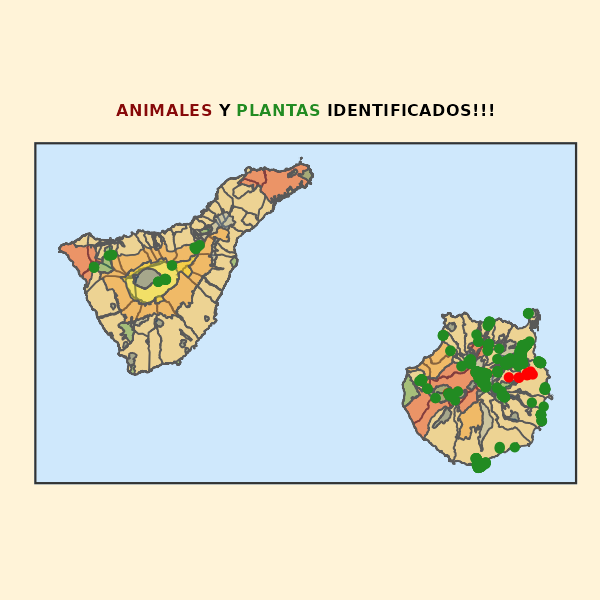

```{r setup, include=FALSE}
knitr::opts_chunk$set(echo = TRUE)
```

```{css, echo = FALSE}
.author, .title {
    display: none;
}
#.main-container {
        #width: 100%;
        #height: 100vh;
#}
body{
    background-color: #fff3d8;
    #font-size: 1.2vw;
}
```
# Bienvenid@ a mi intento de página web!!! 👨‍💻

Humildes comienzos para aprender a desarrllar páginas web con **Github Pages**.

Mi idea es subir por el momento mapas interactivos de especies de flora y fauna que me voy encontrando por la isla de Gran Canaria 🏝️ 

<center>



</center>

## <strong>MAPAS INTERACTIVOS CON LOS ORGANISMOS</strong> 🗺️️

### Mapa de especies de INVERTEBRADOS 🐌 🐜

Aquí documento las especies de invertebrados que he encontrando en Gran Canaria.

* Clica en: <a href="./invertebrates"> MAPA INVERTEBRADOS GC</a> para verlo!

### Mapa de especies de FLORA y VEGETACIÓN 🌺 🌱

Aquí documento las especies de flora y vegetación que he encontrando en Gran Canaria.

* Clica en: <a href="./flora"> MAPA FLORA Y VEGETACIÓN GC</a> para verlo!

Última actualización el `r format(lubridate::today(), "%d/%m/%Y")`  
Sitio [desarrollado](`r rmarkdown::metadata$github_repo`) por [Juan Carlos García Estupiñán](mailto:`r rmarkdown::metadata$email_adress`)
