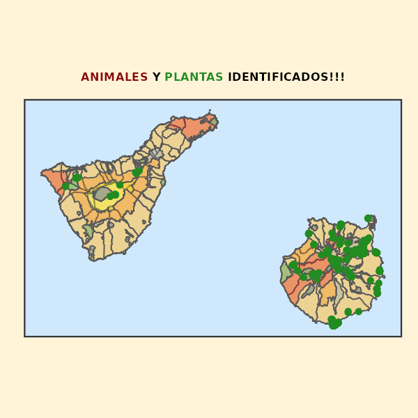

```{r setup, include=FALSE, echo = FALSE}
knitr::opts_chunk$set(echo = TRUE)
```

<link rel="icon" href="figures/GC_mapa.png">

<link rel="preconnect" href="https://fonts.googleapis.com">
<link rel="preconnect" href="https://fonts.gstatic.com" crossorigin>
<link href="https://fonts.googleapis.com/css2?family=Montserrat:ital,wght@0,100..900;1,100..900&family=Roboto+Slab:wght@100..900&family=Roboto:ital,wght@0,100;0,300;0,400;0,500;0,700;0,900;1,100;1,300;1,400;1,500;1,700;1,900&display=swap" rel="stylesheet">

```{css, echo = FALSE}
.author, .title {
    display: none;
}

.main-container {
  max-width: 1400px;
  margin-left: auto;
  margin-right: auto;
  background-color: #fff3d8;
}

body {
  background-color: #dbc79b;
  color: #000000;
  font-family: "Roboto", sans-serif;
  font-weight: 400;
  font-style: normal;
  font-size: 15px;
  background-size: 100%;
}

.button {
    display: inline-block;
    padding: 8px 16px;
    font-size: 18px;
    cursor: pointer;
    text-align: center;
    text-decoration: none;
    outline: none;
    color: #fff;
    background-color: #2777f7;
    border: none;
    border-radius: 12px;
    box-shadow: 0 0px #999;
    margin: 10px;
}

.button:hover {
    background-color: #3e8e41;
}

.button:active {
    background-color: #3e8e41;
    box-shadow: 0 3px #666;
    transform: translateY(2px);
}
```

<center>

<div style="background-color: #F4F4F4; text-align: center;">
# ***<span style='color: green'>Biodiversidad</span><span style='color: #fcc938'>G</span><span style='color: #e8002d'>J</span><span style='color: #1e68a4'>C</span>***
</div>

<hr style="border: 1px solid #317EAC;">

</center>

## **Bienvenid@ a mi página web!!!** 👨‍💻

Mi idea es subir por el momento mapas interactivos de especies de ***flora*** y ***fauna*** en la isla de **Gran Canaria** 🏝️ 

* Las coordenadas se obtendrán ***in situ*** a partir de **fotografías** &#128247; 

<center>



</center>

## <strong>MAPAS INTERACTIVOS CON LOS ORGANISMOS</strong> 🗺️️

### Mapa de especies de <span style='color: #870909'><u>INVERTEBRADOS</u></span> 🐌 🐜

* Aquí documento las especies de invertebrados que he observado en Gran Canaria.

### Mapa de especies de <span style='color: green'><u>FLORA y VEGETACIÓN</u></span> 🌺 🌱

* Aquí documento las especies de flora y vegetación que he Observado en Gran Canaria.

<div style="text-align: center;">
<button class="button" onclick="window.location.href='./invertebrates'">MAPA INVERTEBRADOS</button>
<button class="button" onclick="window.location.href='./flora'">MAPA FLORA Y VEGETACIÓN</button>
<button class="button" onclick="window.location.href='./data'">Descarga de datos y estadísticas</button>
</div>


Última actualización el `r format(lubridate::today(), "%d/%m/%Y")`  
Sitio [**desarrollado**](`r rmarkdown::metadata$github_repo`) por [<u>**Juan Carlos García Estupiñán**</u>](`r rmarkdown::metadata$github`) 
[<u>**&#x2709; GMAIL**</u>](mailto:`r rmarkdown::metadata$email_adress`)
